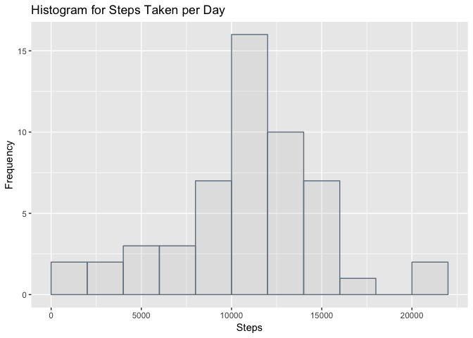
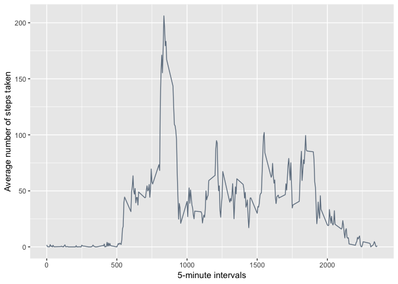
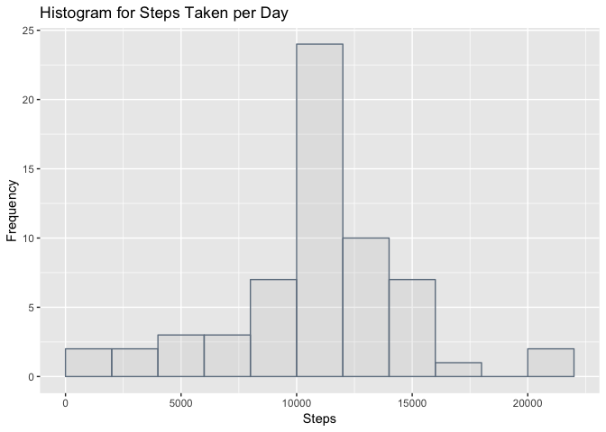
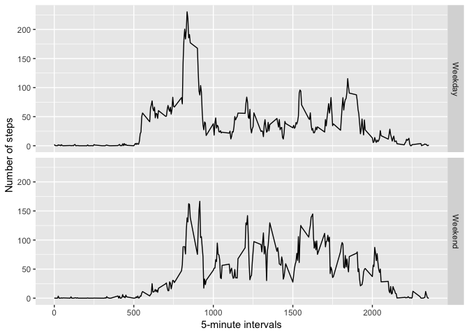

This R Markdown-document is my submission for the first assignment in the course "Reproducible Research".

## Loading and preprocessing the data and loading required libraries


```r
options(warn = -1)
library(ggplot2, quietly = TRUE)

df <- read.csv("activity.csv", sep = ",", header = TRUE) 
```

## What is mean total number of steps taken per day?

In this section of the report, we will take a look at the total number of steps taken each day by plotting a histogram.


```r
steps <- aggregate(df$steps,by=list(df$date),sum)

ggplot(data=steps, aes(steps$x)) +
  geom_histogram(breaks=seq(0,22000,by=2000),
                 col="slategrey",
                 fill="grey",
                 alpha = .2) +
  labs(title="Histogram for Steps Taken per Day") +
  labs(x="Steps", y="Frequency")
```

<!-- -->

Let's also check the mean and median of steps taken per day.


```r
mean(steps$x, na.rm=TRUE)
```

```
## [1] 10766.19
```

```r
median(steps$x, na.rm=TRUE)
```

```
## [1] 10765
```

## What is the average daily activity pattern?


```r
avgact <- aggregate(x=list(steps=df$steps), by=list(interval=df$interval),
                      FUN=mean, na.rm=TRUE) # create agg df first

ggplot(data=avgact, aes(x=interval, y=steps)) +
    geom_line(col="slategrey") +
    xlab("5-minute intervals") +
    ylab("Average number of steps taken")
```

<!-- -->

This leads us to the next question, which 5-minute interval, on average across all the days in the dataset, contains the maximum number of steps?


```r
avgact[which.max(avgact$steps),]
```

```
##     interval    steps
## 104      835 206.1698
```

As the chart already indicated, the interval with the highest number of steps was 835 with a value of over 206 steps.

## Imputing missing values

First, we'll calculate and report the total number of missing values in the dataset (i.e. the total number of rows with NA's)


```r
sum(is.na(df$steps))
```

```
## [1] 2304
```

Next, we'll think of a way to deal with these missing values. <br>
Our approach is going to fill NA's with the mean per interval.


```r
library(dplyr) # forgot to import initially
```

```
## 
## Attaching package: 'dplyr'
```

```
## The following objects are masked from 'package:stats':
## 
##     filter, lag
```

```
## The following objects are masked from 'package:base':
## 
##     intersect, setdiff, setequal, union
```

```r
df_clean <- df %>% 
                group_by(interval) %>% 
                mutate_if(is.numeric, function(x) ifelse(is.na(x), mean(x, na.rm = TRUE), x))
```

```
## `mutate_if()` ignored the following grouping variables:
## Column `interval`
```
As a final step in this part of the assignnment, let's create an updated histogran and recalculate mean and median.


```r
steps_clean <- aggregate(df_clean$steps,by=list(df_clean$date),sum)

ggplot(data=steps_clean, aes(steps_clean$x)) +
  geom_histogram(breaks=seq(0,22000,by=2000),
                 col="slategrey",
                 fill="grey",
                 alpha = .2) +
  labs(title="Histogram for Steps Taken per Day") +
  labs(x="Steps", y="Frequency")
```

<!-- -->


```r
mean(steps_clean$x)
```

```
## [1] 10766.19
```

```r
median(steps_clean$x)
```

```
## [1] 10766.19
```
At least the median appears to be higher compared to before.

## Are there differences in activity patterns between weekdays and weekends?

Create a new factor variable in the dataset with two levels – “weekday” and “weekend” indicating whether a given date is a weekday or weekend day.


```r
df_clean$day <- weekdays(as.Date(df_clean$date))
df_clean$weekday <- ifelse(df_clean$day %in% c("Saturday", "Sunday"), "Weekend", "Weekday")
```

Then we'll finish by plotting the average number of steps for weekdays and weekends


```r
avg_clean <- aggregate(steps ~ interval + weekday, data=df_clean, mean)

ggplot(avg_clean, aes(interval, steps)) + 
        geom_line(c="slategrey") + 
        facet_grid(weekday ~ .) +
        xlab("5-minute intervals") + 
        ylab("Number of steps")
```

<!-- -->
