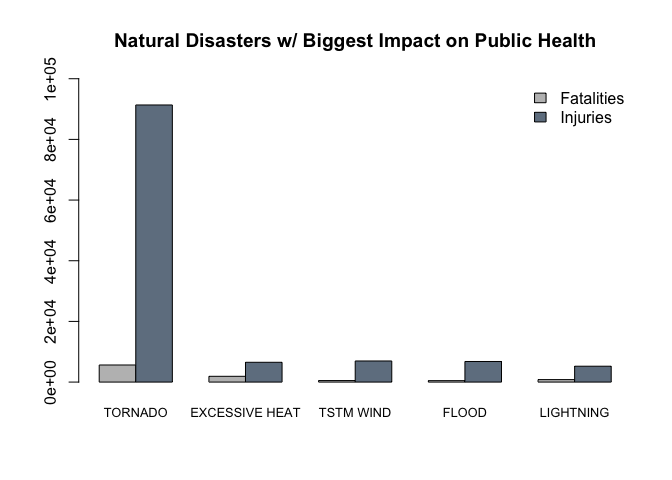
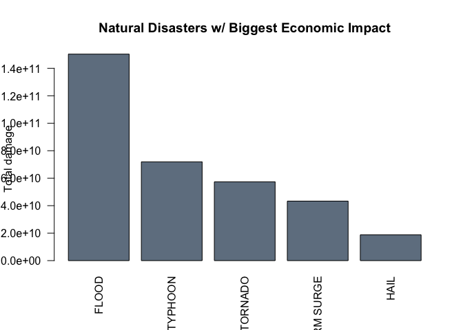

This R Markdown-document is my submission for the second assignment in the course "Reproducible Research".

## Synopsis

Storms and other severe weather events can cause both public health and economic problems for communities and municipalities. Many severe events can result in fatalities, injuries, and property damage, and preventing such outcomes to the extent possible is a key concern.

This project involves exploring the U.S. National Oceanic and Atmospheric Administration's (NOAA) storm database. This database tracks characteristics of major storms and weather events in the United States, including when and where they occur, as well as estimates of any fatalities, injuries, and property damage.

More specifically, we will zoom in on two major questions:

* Across the United States, which types of events are most harmful with respect to population health?
* Across the United States, which types of events have the greatest economic consequences?


## Data processing
### Loading required packages and data


```r
library("dplyr")
```

```
## 
## Attaching package: 'dplyr'
```

```
## The following objects are masked from 'package:stats':
## 
##     filter, lag
```

```
## The following objects are masked from 'package:base':
## 
##     intersect, setdiff, setequal, union
```

```r
library("ggplot2")

storm <- read.csv("repdata_data_StormData.csv.bz2")
```

Before continuing on to answering our two research questions, let's filter out unnecessary columns and look at some descriptive stats.


```r
storm_clean <- storm[ , c(8, 23:28)]
head(storm_clean)
```

```
##    EVTYPE FATALITIES INJURIES PROPDMG PROPDMGEXP CROPDMG CROPDMGEXP
## 1 TORNADO          0       15    25.0          K       0           
## 2 TORNADO          0        0     2.5          K       0           
## 3 TORNADO          0        2    25.0          K       0           
## 4 TORNADO          0        2     2.5          K       0           
## 5 TORNADO          0        2     2.5          K       0           
## 6 TORNADO          0        6     2.5          K       0
```
This leaves us with a dataset containing information for both the impact on Health (denoted by Fatalities and Injuries) and Economic (denoted by the -DMG variables).

At first glance it seems that no further data prep is needed for the Health-variables. We do need to transform the Economic-variables, by putting them in the right format.

According to the provided documentation, the index in the PROPDMGEXP and CROPDMGEXP can be interpreted as given below:-

H, h -> hundreds = x100

K, K -> kilos = x1,000

M, m -> millions = x1,000,000

B,b -> billions = x1,000,000,000


```r
# First check what values there are in PROPDMGEXP and CROPDMGEXP
unique(storm_clean$PROPDMGEXP)
```

```
##  [1] K M   B m + 0 5 6 ? 4 2 3 h 7 H - 1 8
## Levels:  - ? + 0 1 2 3 4 5 6 7 8 B h H K m M
```

```r
unique(storm_clean$CROPDMGEXP)
```

```
## [1]   M K m B ? 0 k 2
## Levels:  ? 0 2 B k K m M
```

```r
# Then recode these variables so that they have the right exponent to them
storm_clean$PROPDMGEXP <- gsub("[Hh]", "2", storm_clean$PROPDMGEXP)
storm_clean$PROPDMGEXP <- gsub("[Kk]", "3", storm_clean$PROPDMGEXP)
storm_clean$PROPDMGEXP <- gsub("[Mm]", "6", storm_clean$PROPDMGEXP)
storm_clean$PROPDMGEXP <- gsub("[Bb]", "9", storm_clean$PROPDMGEXP)
storm_clean$PROPDMGEXP <- gsub("\\+", "1", storm_clean$PROPDMGEXP)
storm_clean$PROPDMGEXP <- gsub("\\?|\\-|\\ ", "0",  storm_clean$PROPDMGEXP)
storm_clean$PROPDMGEXP <- as.numeric(storm_clean$PROPDMGEXP)
storm_clean$CROPDMGEXP <- gsub("[Hh]", "2", storm_clean$CROPDMGEXP)
storm_clean$CROPDMGEXP <- gsub("[Kk]", "3", storm_clean$CROPDMGEXP)
storm_clean$CROPDMGEXP <- gsub("[Mm]", "6", storm_clean$CROPDMGEXP)
storm_clean$CROPDMGEXP <- gsub("[Bb]", "9", storm_clean$CROPDMGEXP)
storm_clean$CROPDMGEXP <- gsub("\\+", "1", storm_clean$CROPDMGEXP)
storm_clean$CROPDMGEXP <- gsub("\\-|\\?|\\ ", "0", storm_clean$CROPDMGEXP)
storm_clean$CROPDMGEXP <- as.numeric(storm_clean$CROPDMGEXP)
storm_clean$PROPDMGEXP[is.na(storm_clean$PROPDMGEXP)] <- 0
storm_clean$CROPDMGEXP[is.na(storm_clean$CROPDMGEXP)] <- 0

# Continue with calculating TOTDMG for Properties and Crops
storm_clean <- mutate(storm_clean, 
                      PROPDMGTOTAL = PROPDMG * (10 ^ PROPDMGEXP), 
                      CROPDMGTOTAL = CROPDMG * (10 ^ CROPDMGEXP))
```

Before going on to answering our research questions we need to aggregate our data first in several dataframes which will allow us to extract the answers we seek.


```r
fatalities <- aggregate(FATALITIES ~ EVTYPE, data = storm_clean, FUN = sum)
fatalities <- fatalities[order(fatalities$FATALITIES, decreasing = TRUE), ]
top10Fatalities <- fatalities[1:10, ]
```


```r
injuries <- aggregate(INJURIES ~ EVTYPE, data = storm_clean, FUN = sum)
injuries <- injuries[order(injuries$INJURIES, decreasing = TRUE), ]
top10Injuries <- injuries[1:10, ]
```


```r
top10Health <- merge(top10Fatalities, top10Injuries, by.x = "EVTYPE", by.y = "EVTYPE")
top10Health <- arrange(top10Health,desc(FATALITIES+INJURIES))
events <- top10Health$EVTYPE
top10Health <- top10Health[1:5, ]
```


```r
economic <- aggregate(cbind(PROPDMGTOTAL, CROPDMGTOTAL) ~ EVTYPE, data = storm_clean, FUN=sum)
economic$DMGTOTAL <- economic$PROPDMGTOTAL + economic$CROPDMGTOTAL
economic <- economic[order(economic$DMGTOTAL, decreasing = TRUE), ]
top10Economic <- economic[1:5,]
```


## Research question 1

<i> Across the United States, which types of events are most harmful with respect to population health? </i>

In order to answer this question, we will need to look at the 5 biggest events to lead to fatalities and injuries.


```r
barplot(t(top10Health[,-1]), names.arg = top10Health$EVTYPE, ylim = c(0,100000), beside = T, cex.names = 0.8, col = c("grey", "slategrey"), main="Natural Disasters w/ Biggest Impact on Public Health")
legend("topright",c("Fatalities","Injuries"),fill=c("grey","slategrey"),bty = "n")
```

<!-- -->


## Research question 2

<i>Across the United States, which types of events have the greatest economic consequences? </i>


```r
barplot(top10Economic$DMGTOTAL, names.arg = top10Economic$EVTYPE, las = 2, col = "slategrey", main = "Natural Disasters w/ Biggest Economic Impact", ylab = "Total damage")
```

<!-- -->

## Results

After performing this analysis we can conclude that different natural events have different impacts. We can conclude that Tornado's and Excessive Heat have the biggest impact when it comes to fatalities and injuries. Floods on the other hand are the major contributor when it comes to economic damage (total amount, sum of property and crop damages).


